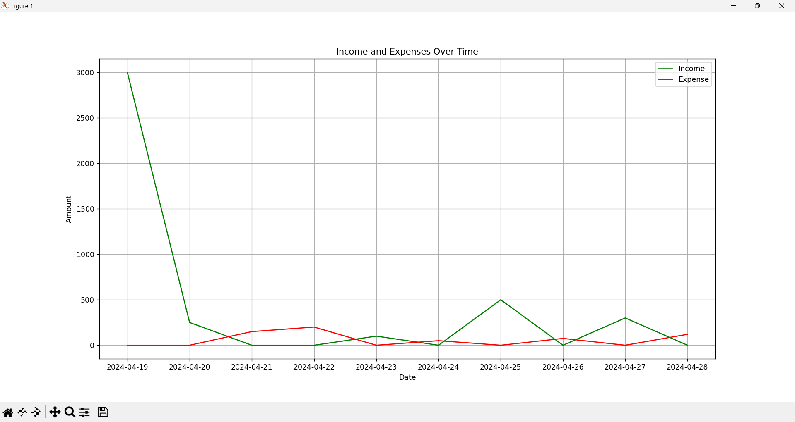

# Finance Tracker

A simple Python CLI tool to track income and expenses, store them in CSV, and visualize financial trends.

## 💰 Personal Finance Tracker (Command Line)

This is a simple **command-line Python application** to help you **track income and expenses**, store them in a CSV file, and view summaries within custom date ranges.

## 📦 Features

- Add income and expense transactions  
- Save transactions to a CSV file  
- View transactions within a date range  
- Summary of total income, expenses, and savings  
- Optional visualization of trends using Matplotlib  

## 🛠️ Requirements

- Python 3.x  
- Required libraries:
  - `pandas`
  - `matplotlib`

Install dependencies with:

pip install pandas matplotlib

Follow the menu:

- Add a transaction  
- View transactions in a date range  
- Exit  

## 📁 Project Structure

finance-tracker/
├── main.py # Main program with logic and summary
├── data_entry.py # Handles user inputs and validation
├── finanace_data.csv # Stores all transaction data
└── README.md # Project documentation

## 📝 Data Format (CSV)

Each transaction is stored with the following fields:

- `date` – Format: `dd-mm-yyyy`  
- `amount` – Positive float  
- `category` – "Income" or "Expense"  
- `description` – Optional  

## 🧠 Example Use Case

Track daily income and expenses like:

- Salary, freelance income  
- Food, shopping, transport  
- Automatically generate savings summaries  

## 📊 Plot Preview

Example:

## 🚀 Future Ideas

- Category filters (e.g., only food, bills)  
- Monthly / yearly statistics  
- Export as PDF or Excel  
- Convert to GUI or web app  

## 🙌 Author

Built with ❤️ by **Aditya**  
Feel free to fork, use, or contribute to this project.

